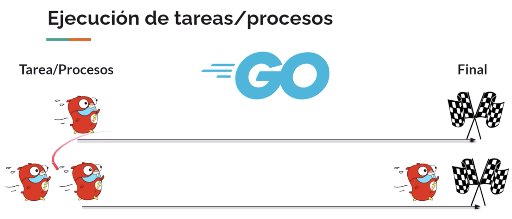
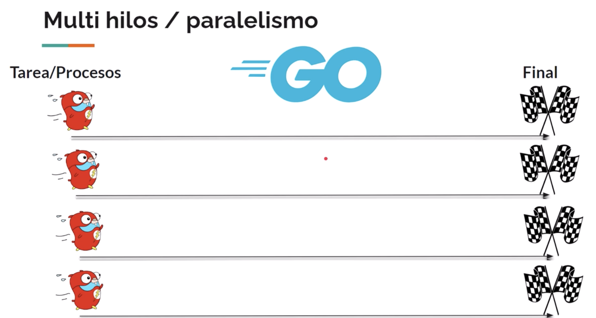
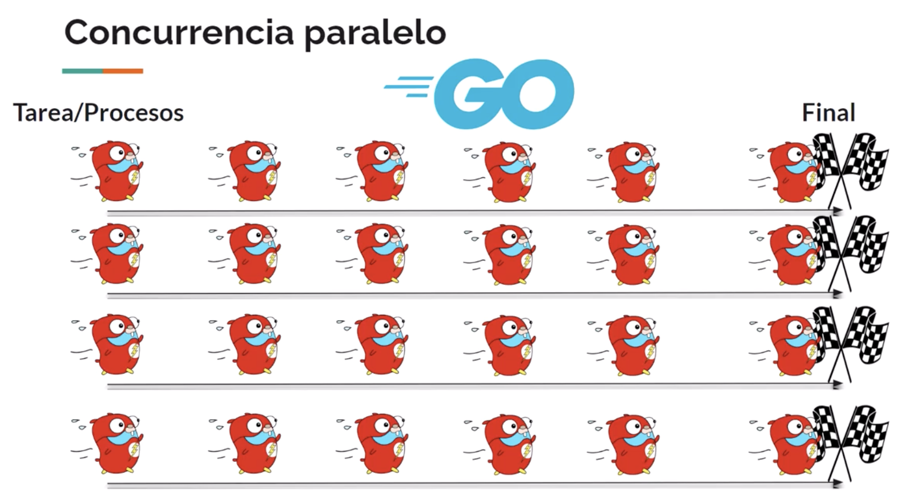

# GO
Curso de GO con actividades y ejercicios separados por temas.

## Caracteristicas:
- Código abierto
- Compilado
- Tipado Estático
- Multiplataforma y multiparadigma
- Manejo de concurrencia: Permite que cualquier función se ejecute como un subproceso ligero, simplemente usando la palabra reservada go para implementar la concurrencia
- Biblioteca estándar muy grande
- Simple, sencillo y fácil de aprender
- Administración automática de la memoria, como la recoleccion de elementos no utilizados
- Hereda aspectos de C
- Comparte similitudes con Java y Python
- Algunas caracteríticas de POO pero simplificadas

Documentación: https://go.dev/doc

## Playground de GO:
No podemos utilizar paquetes externos, si el usuario tiene que interactuar tampoco vamos a poder hacer entradas.
````
// Todos los archivos de GO deben pertenecer a un paquete. Aca indicamos que pertenece al paquete principal
package main

// Importamos el paquete estándar de entrada y salida de datos
import "fmt"

// Aca indicamos que es la funcion principal con la palabra reservada main. Desde esta función es desde donde inicia a ejecutarse una app
func main() {
	fmt.Println("Hola mundo ;), 世界")
}
````

## Comandos
`go run nombre-archivo.go` Nos corre la funcion
`go build nombre-archivo.go` Nos genera un exe y ya podemos correrlo de forma mas sencilla
`./nombre-archivo`

## Paquetes de Terceros (Externos)
Tenemos que inicializar un manejador de módulos para nuestra app: `go mod init nombre-manejador-modulo-que-quiera`
Se crea un archivo `go.mod` que contiene el nombre del manejador de módulos y la versión de go. 
Se utiliza para definir y gestionar los módulos y las dependencias de mi proyecto en go.
Cuando descarguemos archivos externos se genera el archivo `go.sum` que registra la suma de verificaciones de los módulos y dependencias de proyecto.

Instalar paquete externo: `go get rsc.io/quote` y se agrega al go.mod
Luego lo puedo importar:
````
import "rsc.io/quote"

func main() {
    fmt.Println(quote.Hello())
}
````

## POO
### Pilares
- Abstracción: Forma de llevar los objetos del mundo real al código
- Encapsulación: Los modificadores de acceso
- Herencia
- Polimorfismo

### POO en GO
````
Aunque GO no es un lenguaje orientado a objetos puro, puede utilizarse para escribir código orientado a objetos utilizando estructuras, métodos, interface, composición y encapsulamiento.
````

Clases = Estructuras serían el modelo de un objeto
Métodos = Funciones que tienen un receptor (tiene que ser la estructura del cual va a ser este método)
Encapsulamiento = No tiene public ni private, se logra utilizando convenciones de nomenclatura.
Si empiezo una funcion con mayuscula quiere decir que es pública, y si es minuscula quiere decir que es privada.
Composición = Modelar relaciones entre objetos, implica que la creación de una estructura contiene otra estructura, podemos acercarnos a la herencia.
Interfaces = Tipos abstractos que definen un conjunto de métodos, permite que diferentes tipos implementen el mismo conjunto de métodos, lo que permite el polimorfismo. 

## Concurrencia
````
Permite la ejecucion concurrente de multiples tareas. Estas tareas son similares a los hilos que son los multihilos en otros lenguajes. Los GO routines son independientes entre si y se ejecutan de manera concurrente, lo que significa que pueden ejecutarse de forma simultanea o en orden no determinista.
````
- GO routines: Funciones independientes que se ejecutan de forma concurrente y ligero, nos permiten realizar multiples tareas simultaneamente y aprovechar al máximo la potencia de los procesadores modernos.
- Canales: Son herramientas fundamentales para la comunicacion y sincronizacion entre go routines, permitiendo enviar y recibir datos de manera segura y coordinada y evitando muchos problemas.

### Ejecución de tareas en GO:
````
Primero se ejecuta la primer tarea hasta que termine de ejecutarse el primer proceso, y los demás procesos se encolan esperando a que el primer proceso termine. Cuando el primer proceso llega al final, recién pasaria a ejecutarse el siguiente proceso.
Entonces la ejecución de múltiples procesos va a ser lenta, porque si el primer proceso hace muchas cosas y demora mucho tiempo, entonces para que se ejecute el siguiente proceso aunque sea mas corto tiene que esperar al primero.
````


### Solución: Multihilos / Paralelismo
````
Si queremos ejecutar cuatro procesos o tareas, cada una representa un núcleo y necesitariamos cuatro núcleos. 
Si tenemos 10 procesos tambien se van a encolar aunque tengamos cuatro núcleos.
````


### Concurrencia en GO:
````
Cuando el primer proceso esta a punto de terminar de ejecutarse ya se esta ejecutando el siguiente proceso, y asi sucesivamente.
Entonces la siguiente tarea ya no tiene que esperar hasta que termine de ejecutarse el primer proceso. 
Si nosotros utilizamos varios nucleos para ejecutar multiples procesos, podriamos ejecutar 30 procesos simultaneamente utilizando cuatro nucleos.
````


## Genéricos:
````
Nos permiten la creación de funciones y estructuras que pueden trabajar con diferentes tipos de datos de manera segura y eficiente sin tener que duplicar código.
````
Podemos utilizar restricciones que tiene GO descargando el paquete:
`go mod init generic`
`go get golang.org/x/exp/constraints`
````
import (
	"fmt"

	"golang.org/x/exp/constraints"
)
````

## GIN: Framework
Framework de GO para desarrollo web. Proporciona características y herramientas para facilitar el desarrollo de aplicaciones web y APIs.
La principal característica es el enrutamiento para crear rutas de manera simple. También la parte de middleware para manejar la autenticación y seguridad de la app, validación de datos, renderización de plantillas para trabajar con archivos JSON o XML, controladores y middlewares personalizados.

Para instalarlo:
`go get -u github.com/gin-gonic/gin`